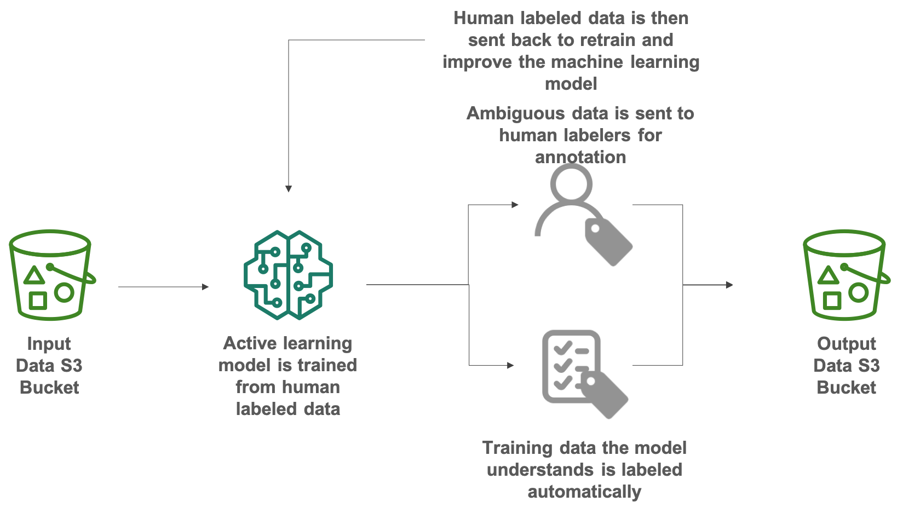
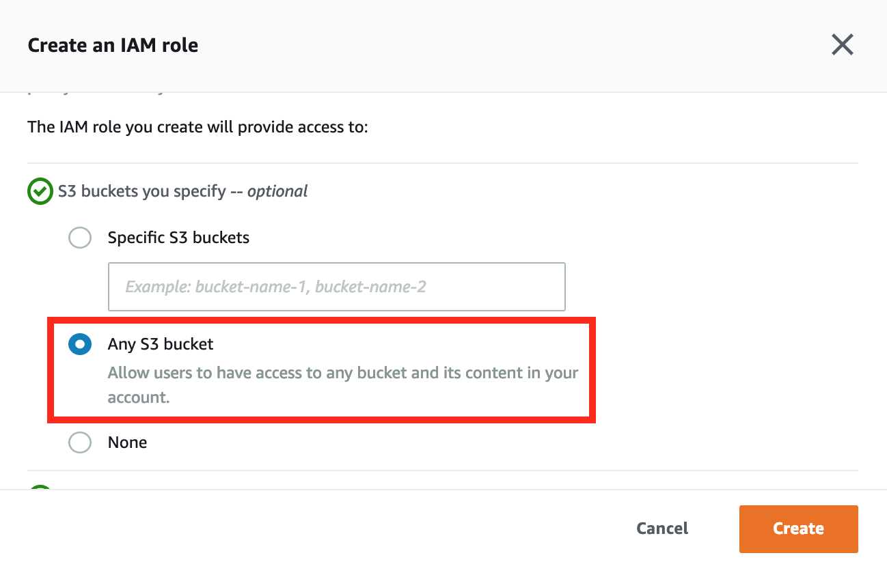
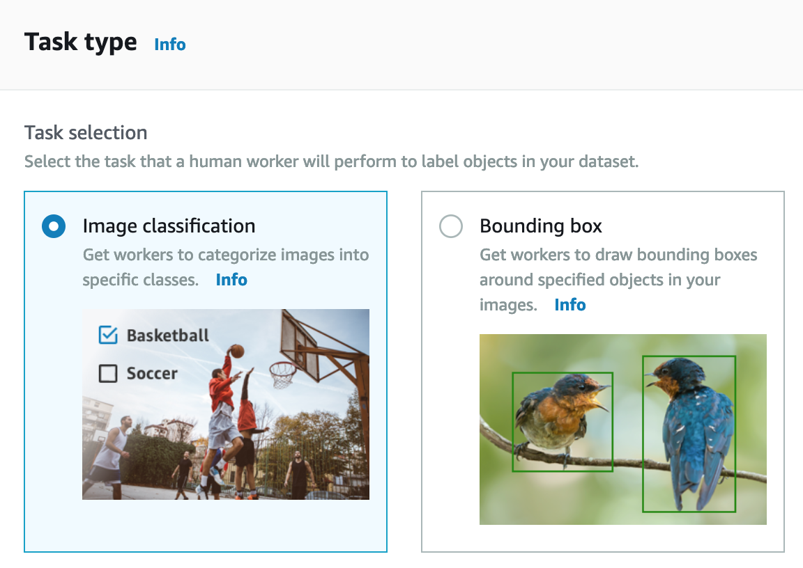

Labeling Data with SageMaker Ground Truth
=========================================
## Overview
Today, __Machine Learning__ is mainly used in supervised learning. Supervised learning using large amounts of data to enable machine learning or build a model, and use this mode to classify or predict new data. 

It's like people saw a rabbit, at first when no one told us it was a rabbit, we might not understand what it was. But when someone showed us a thousand times the rabbit and told us he was a rabbit. The next time we see it, we know it's a rabbit. 

A common problem for banks is credit card transaction data, which may contain normal transactions or fraudulent behavior in a large amount of transaction data. Machine learning real-time forecasting can prevent losses from fraudulent behavior. That's why we understand the keys to impact accuracy of supervised learning is training datasets, and it's important to ensure the accuracy of training datasets. 

In many companies, it takes a lot of time to label special training sets, such as the identification of medical images. Tagging thousands of images or text takes a lot of time and labor. 

To resolve high labor costs and insufficient staff, Amazon has introduced [__Amazon SageMaker Groud Truth__](https://aws.amazon.com/tw/sagemaker/groundtruth/) to accelerate the construction of highly accuratedata sets, and reduce the labor costs of labeling, can reduce costs by up to 70%, and these savings are achieved through the use of automatic labeling for data.

## Scenario

With this Lab, you will use Amazon SageMaker Groud Truth to quickly labeling datasets, classify and add label of cats and dogs images, and this Lab will use public labor with automatic labeling technology. At last, store the results of classification to S3 Bucket.

<center></center>

## Step by Step
### Create the first Bucket to store input data
Here we create a S3 bucket to store the input data for data labeling.

- On the __Service__ menu, click __S3__, Click __Create Bucket__ .

- For __Bucket Name__, type __Unique Name__.

- For __Region__, choose __US East (N. Virginia)__, Click __Create__.
<center></center>

- Select the bucket which you created before, Click __Upload__ then drag the images in this __folder__ to S3 bucket to be the input data, and click __Upload__.
<center></center>

<!-- - Download the folder `label images` in this link, and upload the images in this folder to S3 bucket to be the input data. -->
- You will see images in your bucket.
<center></center>

### Create the second Bucket to store output data
When __SageMaker Ground Truth__ finish the labeling job, it will export a __manifest file__ to S3 bucket, so here create another bucket for output data.

- On the __Service__ menu, click __S3__, Click __Create Bucket__ .

- For __Bucket Name__, type __Unique Name__.

- For __Region__, choose __US East (N. Virginia)__, Click __Create__.
<center></center>

### Create a Labeling Job

- On the service menu, select __SageMaker__ and at the left panel, choose __Labeling jobs__ .
<center></center>

- Choose __Create labeling job__ to add a new job for labeling data.

-  In the __Job overview__ form, following these step:
    
    - Job name : `classify-cat-and-dog`
    
    - Input dataset location : 
        > The bucket and dataset objects must be in the us-east-1 region
        - Choose __Create manifest file__ to create the manifest file that contain all input data location in S3 bucket.
            1. Input dataset location : Enter the bucket name `s3://<your input data bucket name>` for store input data. 
            2. Data type : Select __Images__ as your data type, and Click __Create__.
            
            <center></center>

        - In the bottom of __Create manifest file__ window, the success message to create a manifest will show up. And click __Use this manifest__ to choose this file as your input file.
        <center></center>
    
    - Output dataset location : Type the bucket name `s3://<your output data bucket name>` for output data.
        > The bucket and dataset objects must be in the us-east-1 region
    
    - IAM Role : When using SageMaker Ground Truth to labeling data, it needs permission to access S3 bucket.
        
        - Select __Create a new role__.
        <center></center>
        
        - In the __Create an IAM role__ window, choose __Any S3 bucket__ to allow this role have access to any bucket, and click __Create__.
        <center></center>

    - Expand __Additional configuration__ : 
        - Datasets object selection : Choose __Full dataset__ use all data as input data.
        > __Another options__ : If you want to use part of you data as sample, select Random sample and setup the sample size for random sample. You can also use Filtered subset and use SQL expressions to query your dataset.
        
        - Encryption key : Use default setting to encryption output data with S3 service key.
    
    - All setting will like below.  
    <center></center>
    <center></center>

- In the __Task type__ section : Choose __Image classification__ to classify cat and dog, and click __Next__.
<center></center>

- In the __Workers__ part :
    
    - __Worker types__ : Select __Pubilc__ to use __Amazon Mechanical Turk__ workforce to label your dataset.
    
    - __Price per task__ : Choose __0.012__ as the price you pay to workers.
        > It will depends on how long workers to complete the work.
    
    - Enable __The dataset does not contain adult content.__
    
    - Enable __I understand that my dataset will be viewed by the Amazon Mechanical Turk public workforce and I acknowledge that my dataset does not contain personally identifiable information (PII).__

    - Expand __Additional configuration__ : 
        
        - Select __Enable__ in __Automated data labeling__ part, it will automatically label a portion of your dataset.
        
        - Enter __3__ in the __Number of workers per dataset object__ filed, you can improve acccuracy by increase number. 
    <center></center>
    <center></center>

- In the __Image classification labeling tool__ part : 
    
    - Delete the text in left block.
    
    - Enter the following as description of this task.
        ```
        Please Classify cat and dog, thank you.
        ```
    - On the __Select an option__, add `cat` and `dog` as label.
    <center></center>

- Select __Submit__ to submit labeling job for workers.

- Back to console, you will see the labeling job is in progress.
<center></center>

- Please wait for the status become __Complete__.
> Here may take few time to complete.
<center></center>

- Click th job named __classify-cat-and-dog__ and scroll down choose __Output__ section to check the data after labeling. You will see all data had been labeling and classification.

<center></center>

## Furthermore
Amazon SageMaker Groud Truth offers three kinds of workforce for enterprise and users: 

- AmazonMechanical Turk's Public Workforce: Workers are available 24 hours a day, 7 days a week. Offering a rapidly scalable workforce for small and data-heavy enterprise. 

- Private workforce within your organization: Tag data using in-house teams and use Amazon Cognito, social accounts (Google, Facebook),OpenID Connect providers authenticate, so you can address issues such as the need for confidentiality or privacy of your data. 

- Professional workforce from third-party vendors: Suppliers have extensive experience in data labeling, you can select the vendor to meet the time  costs and expectations to the list provide by suppliers.

## Conclusion

By completing these tutorials, you will learn how to labeling your data with Amazon SageMaker Groud Truth and choose the way that best suits your needs to create a labeling process. Amazon SageMaker Groud Truth not only has a wide choice of workforce, but also allows enterprise to choose image classification, text classification, and object inspection, etc., to build the dataset. 

Because of the convenience of the Internet, social media produces a growing amount of data, and businesses must preprocess data before analyzing it. Large amounts of data increase the labor demand and cost of data labeling. Company are looking for how to speed up data labeling and reducing costs. Amazon SageMaker Groud Truth is one of the services that can resolve this issue.